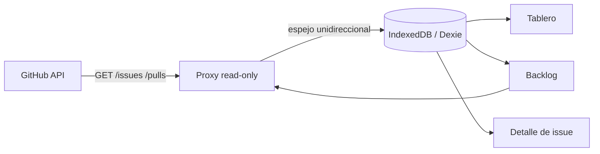

<div align="center">

# 🗂️ MeperBoard

**Un tablero kanban y backlog local-first para tus issues y pull requests de GitHub.**

Sincronización de solo lectura con GitHub, almacenamiento offline-first, UX pensada para teclado — con el pulido de una herramienta moderna para desarrolladores.

<p>
  <a href="https://meperboard.vercel.app"><strong>Demo en vivo ↗</strong></a>
  ·
  <a href="#caracteristicas">Características</a>
  ·
  <a href="#primeros-pasos">Primeros pasos</a>
  ·
  <a href="#como-funciona">Cómo funciona</a>
  ·
  <a href="#arquitectura">Arquitectura</a>
  ·
  <a href="#contribuir">Contribuir</a>
  ·
  <span>🌐 <a href="./README.md">English</a></span>
</p>

<p>
  
  
  
  
  
  
</p>

</div>

---

## ✨ Características

### Tablero, como lo piensa tu cerebro
- **Tablero kanban** con tarjetas drag-and-drop ([dnd-kit](https://dndkit.com/)) y animaciones fluidas de [Framer Motion](https://motion.dev/).
- **Mapeo inteligente de columnas** — los issues y PRs caen en la columna correcta automáticamente según su estado en GitHub, y tus movimientos manuales se conservan incluso tras re-sincronizar.
- **Agrupación por slices y features** — los slices que coinciden con el título de un epic se agrupan en una jerarquía padre/hijo (`Expenses module - slice 3` → `Expenses`).

### Backlog, sin el ruido
- **Filtra y ordena** por etiqueta, tipo y campo con un orden determinista.
- **Backlog paginado** (25/50/100 por página) con paginador visible — nada de scroll infinito.

### Local-first y privado
- **Almacenamiento offline-first** en [IndexedDB](https://dexie.org/) vía Dexie. Tus datos son tuyos, en tu máquina.
- **Tarjetas locales** que la sincronización de GitHub nunca toca — creá, editá y borrá tarjetas que se mantienen mientras sincronizás.
- **Sincronización de solo lectura** — MeperBoard *nunca* escribe a GitHub. Espejo unidireccional, garantizado por un proxy GET-only.

### GitHub, conectado
- **Iniciá sesión con GitHub** vía una GitHub App de solo lectura — sin pegar tokens, sin acceso de escritura.
- **Token por usuario** guardado en una cookie cifrada HTTP-only, jamás expuesto al JavaScript del cliente.
- **Selector de repositorios en vivo** — navegá y cambiá entre tus repositorios desde una command palette.
- **Manejo transparente de rate limit** con back-off automático e indicador de rate limit en vivo.

### Keyboard-first, como debe ser
- **Command palette ⌘K** — navegá, cambiá el tema, cambiá de repo, sincronizá y más, todo desde el teclado.
- Accesibilidad completa por teclado en el tablero (movés tarjetas con flechas) y en la palette.
- Un sistema de diseño dark-first inspirado en Linear con paletas de acento intercambiables.

---

## 🚀 Primeros pasos

### Requisitos
- Node.js 20+
- Una cuenta de GitHub (para el flujo OAuth) — opcional si solo querés la experiencia anónima de solo lectura.

### Instalación

```bash
git clone https://github.com/MeperDonas/MeperBoard.git
cd MeperBoard
npm install
```

### Ejecutar en local

```bash
npm run dev
```

Abrí [http://localhost:3000](http://localhost:3000).

> Sin `AUTH_SECRET`, la app corre en **modo desarrollo** con un secreto de respaldo inseguro. Para usar autenticación de GitHub, ver [Configuración](#configuracion).

### Scripts

| Script | Descripción |
| --- | --- |
| `npm run dev` | Servidor de desarrollo |
| `npm run build` | Build de producción |
| `npm start` | Servidor de producción |
| `npm run test` | Correr la suite de tests (Vitest) |
| `npm run test:watch` | Tests en modo watch |
| `npm run typecheck` | Type-check con `tsc --noEmit` |

---

## ⚙️ Configuración

MeperBoard usa algunas variables de entorno para la autenticación con GitHub. Ninguna es obligatoria para correr el tablero en local; la auth de GitHub simplemente no estará disponible hasta que las configures.

| Variable | Requerida | Propósito |
| --- | --- | --- |
| `AUTH_SECRET` | ✅ (producción) | Secreto usado para derivar la clave AES que cifra las cookies de sesión. **Debe ser ≥ 32 caracteres.** |
| `GITHUB_CLIENT_ID` | ✅ (auth) | Client ID de tu [GitHub App](https://docs.github.com/en/apps/creating-github-apps). |
| `GITHUB_CLIENT_SECRET` | ✅ (auth) | Client secret de tu GitHub App. |
| `ALLOWED_ORIGIN` | recomendada | Lista de orígenes permitidos para el proxy. Por defecto `https://meperboard.vercel.app`. |
| `AUTH_MODE` | opcional | `oauth` (default) o `pat` — usá `pat` para autenticar con un personal access token clásico en self-hosting. |
| `GITHUB_TOKEN` | modo `pat` | Personal access token usado en `AUTH_MODE=pat`. |

### Configurar una GitHub App (para OAuth)

1. Creá una [GitHub App](https://github.com/settings/apps/new) para tu dominio.
2. Configurá la **callback URL** como `https://<tu-dominio>/api/auth/callback`.
3. Otorgá acceso **Read-only** a **Issues** y **Pull requests** (Metadata es requerida y de solo lectura por defecto).
4. **Habilitá "Expire user authorization tokens"** — MeperBoard depende del refresh de tokens.
5. Copiá el **Client ID** y generá un **Client secret**.

> MeperBoard es de solo lectura: nunca solicita acceso de escritura. Ver [Seguridad](#seguridad).

---

## 🔒 Seguridad

- **Garantía de solo lectura.** El proxy de GitHub acepta solo requests `GET` y aplica una allow-list de rutas del repositorio. Una escritura es estructuralmente imposible.
- **Los tokens nunca llegan al navegador.** Los user access tokens se cifran (`jose` JWE, `A256GCM`) en una cookie `httpOnly + Secure + SameSite=Lax`. El JavaScript del cliente jamás puede leerlos.
- **Estado de sesión cifrado.** El `state` de OAuth se guarda en una cookie cifrada de un solo uso para prevenir CSRF.
- **Content-Security-Policy estricta** con nonce por request, más renderizado de Markdown sanitizado ([DOMPurify](https://github.com/cure53/DOMPurify)) para cuerpos de issues/PRs.
- **Protección contra open relay.** El proxy valida el `Origin`/`Referer` de la request contra `ALLOWED_ORIGIN` y bloquea callers no autorizados.

Ver la [guía de self-hosting](/docs/SELF_HOST.md) para la alternativa con PAT.

---

## 🧠 Cómo funciona

MeperBoard es un **espejo local-first**: trae tus issues y PRs de GitHub a una base de datos IndexedDB en tu dispositivo, y los renderiza desde esa copia local. La sincronización es siempre de solo lectura y siempre a tu manera — traés datos, nunca empujás un cambio de vuelta.



Vos ponés tu propia identidad (OAuth con GitHub App) y tu propio navegador — MeperBoard es una capa delgada y bien tipada sobre tus propios datos.

---

## 🏛️ Arquitectura

- **Next.js 16** (App Router) + **React 19** + **TypeScript** + **Tailwind CSS 4**.
- **Dexie / IndexedDB** para el store offline-first (`repos`, `github_items`, `local_items`, `columns`, `epics`, `column_overrides`).
- **TanStack Query** para server-state y caché optimista.
- **Conector de sync unidireccional** con capa de estrategias de columna pluggable.
- **Proxy de GitHub de solo lectura** (`/api/github/[...path]`) — GET-only, con check de origen e inyección de token.

```
src/
├── app/            # Rutas de Next.js (páginas + API routes)
├── components/     # Componentes React (tablero, backlog, header, ui)
├── data/           # Repositorios y tipos de Dexie
├── domain/         # Conector de sync, lógica del proxy, estrategias de columna, rate limiter
├── lib/            # Auth (session, oauth), utilidades
└── state/          # Hooks de TanStack Query y proyecciones
```

---

## 🧪 Tests

La suite de tests corre con [Vitest](https://vitest.dev/) con [Testing Library](https://testing-library.com/) y `fake-indexeddb`.

```bash
npm run test
```

- **Unit** — lógica de dominio pura (proxy, conector, rate limiter, estrategias de columna, cripto de sesión).
- **Integración / Componente** — componentes y hooks renderizados contra un IndexedDB mockeado.

> 381 tests en 48 archivos.

---

## 🤝 Contribuir

¡Las contribuciones son bienvenidas! Para empezar:

1. **Fork** del repo y creá una rama de feature.
2. Seguí las convenciones existentes: TypeScript estricto, conventional commits, TDD (escribí el test que falla primero).
3. Mantené intacta la garantía de solo lectura — nunca agregues un camino de escritura al proxy de GitHub.
4. Corré `npm run typecheck` y `npm run test` antes de abrir un PR.

> Este proyecto se construye con un flujo de trabajo TDD estricto. El comportamiento nuevo llega con su test.

---

## 📄 Licencia

Publicado bajo la [Licencia MIT](./LICENSE).

Copyright © 2026 [MeperDonas](https://github.com/MeperDonas).

---

<div align="center">

Hecho con ❤️ para la gente que ama su backlog.

</div>
