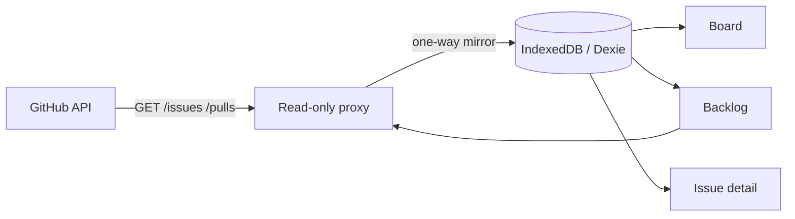

<div align="center">

# 🗂️ MeperBoard

**A local-first kanban & backlog board for your GitHub issues and pull requests.**

Read-only GitHub sync, offline-first storage, keyboard-first UX — with the polish of a modern dev tool.

<p>
  <a href="https://meperboard.vercel.app"><strong>Live demo ↗</strong></a>
  ·
  <a href="#features">Features</a>
  ·
  <a href="#getting-started">Getting started</a>
  ·
  <a href="#how-it-works">How it works</a>
  ·
  <a href="#architecture">Architecture</a>
  ·
  <a href="#contributing">Contributing</a>
  ·
  <span>🌐 <a href="./README.es.md">Español</a></span>
</p>

<p>
  
  
  
  
  
  
</p>

</div>

---

## ✨ Features

### Board, the way your brain works
- **Kanban board** with drag-and-drop cards ([dnd-kit](https://dndkit.com/)) and smooth [Framer Motion](https://motion.dev/) flight animations.
- **Smart column mapping** — issues and PRs land in the right column automatically based on their GitHub state, with your manual moves preserved even after re-sync.
- **Slice & feature grouping** — board slices that match an epic title are grouped into a parent/child hierarchy (`Expenses module - slice 3` → `Expenses`).

### Backlog, without the noise
- **Filter and sort** by label, type, and field with deterministic ordering.
- **Paginated backlog** (25/50/100 per page) with a visible pager — no endless scroll.

### Local-first & private
- **Offline-first storage** in [IndexedDB](https://dexie.org/) via Dexie. Your data is yours, on your machine.
- **Local cards** that GitHub sync never touches — create, edit, and delete cards that stay put while syncing.
- **Read-only GitHub sync** — MeperBoard *never* writes to GitHub. One-way mirror, guaranteed by a GET-only proxy.

### GitHub, connected
- **Sign in with GitHub** via a read-only GitHub App — no tokens to paste, no write access.
- **Per-user token** stored in an HTTP-only encrypted cookie, never exposed to client JavaScript.
- **Live repository switcher** — browse and switch between your repositories from a command palette.
- **Transparent rate-limit handling** with automatic back-off and a live rate-limit indicator.

### Keyboard-first, like you mean it
- **⌘K command palette** — navigate, change theme, switch repo, sync, and more, all from the keyboard.
- Full keyboard accessibility on the board (move cards with arrows) and the palette.
- A Linear-inspired dark-first design system with switchable accent palettes.

---

## 🚀 Getting started

### Prerequisites
- Node.js 20+
- A GitHub account (for the OAuth flow) — optional if you only want the anonymous read-only experience.

### Install

```bash
git clone https://github.com/MeperDonas/MeperBoard.git
cd MeperBoard
npm install
```

### Run locally

```bash
npm run dev
```

Open [http://localhost:3000](http://localhost:3000).

> Without `AUTH_SECRET` set, the app runs in **development mode** with an insecure fallback secret. To use GitHub authentication, see [Configuration](#configuration).

### Scripts

| Script | Description |
| --- | --- |
| `npm run dev` | Start the dev server |
| `npm run build` | Production build |
| `npm start` | Start the production server |
| `npm run test` | Run the test suite (Vitest) |
| `npm run test:watch` | Run tests in watch mode |
| `npm run typecheck` | Type-check with `tsc --noEmit` |

---

## ⚙️ Configuration

MeperBoard uses a few environment variables for GitHub authentication. None are required to run the board locally; GitHub auth simply won't be available until you set them.

| Variable | Required | Purpose |
| --- | --- | --- |
| `AUTH_SECRET` | ✅ (production) | Secret used to derive the AES key that encrypts session cookies. **Must be ≥ 32 characters.** |
| `GITHUB_CLIENT_ID` | ✅ (auth) | Client ID of your [GitHub App](https://docs.github.com/en/apps/creating-github-apps). |
| `GITHUB_CLIENT_SECRET` | ✅ (auth) | Client secret of your GitHub App. |
| `ALLOWED_ORIGIN` | recommended | Comma-separated list of allowed origins for the proxy. Defaults to `https://meperboard.vercel.app`. |
| `AUTH_MODE` | optional | `oauth` (default) or `pat` — use `pat` to authenticate with a classic personal access token for self-hosting. |
| `GITHUB_TOKEN` | `pat` mode | Personal access token used in `AUTH_MODE=pat`. |

### Set up a GitHub App (for OAuth)

1. Create a [GitHub App](https://github.com/settings/apps/new) for your domain.
2. Set the **callback URL** to `https://<your-domain>/api/auth/callback`.
3. Grant **Read-only** access to **Issues** and **Pull requests** (Metadata is required and read-only by default).
4. **Enable "Expire user authorization tokens"** — MeperBoard relies on token refresh.
5. Copy the **Client ID** and generate a **Client secret**.

> MeperBoard is read-only: it never requests write access. See [Security](#security).

---

## 🔒 Security

- **Read-only guarantee.** The GitHub proxy accepts `GET` requests only and enforces an allow-list of repository paths. A write is structurally impossible.
- **Tokens never reach the browser.** User access tokens are encrypted (`jose` JWE, `A256GCM`) into an `httpOnly + Secure + SameSite=Lax` cookie. Client JavaScript can never read them.
- **Encrypted session state.** OAuth `state` is stored in a single-use, encrypted cookie to prevent CSRF.
- **Strict Content-Security-Policy** with a per-request nonce, plus sanitized Markdown rendering ([DOMPurify](https://github.com/cure53/DOMPurify)) for issue/PR bodies.
- **Open-relay protection.** The proxy validates the request `Origin`/`Referer` against `ALLOWED_ORIGIN` and blocks unauthorized callers.

See the [self-hosting guide](/docs/SELF_HOST.md) for the PAT alternative.

---

## 🧠 How it works

MeperBoard is a **local-first mirror**: it pulls your GitHub issues and PRs into an IndexedDB database on your device, then renders them from that local copy. Syncing is always read-only and always on your terms — pull the data, never push a change back.



You supply your own identity (GitHub App OAuth) and your own browser — MeperBoard is a thin, well-typed layer over your own data.

---

## 🏛️ Architecture

- **Next.js 16** (App Router) + **React 19** + **TypeScript** + **Tailwind CSS 4**.
- **Dexie / IndexedDB** for the offline-first store (`repos`, `github_items`, `local_items`, `columns`, `epics`, `column_overrides`).
- **TanStack Query** for server-state and optimistic cache.
- **One-way sync connector** with a pluggable column-strategy layer.
- **Read-only GitHub proxy** (`/api/github/[...path]`) — GET-only, origin-checked, token-injecting.

```
src/
├── app/            # Next.js routes (pages + API routes)
├── components/     # React components (board, backlog, header, ui)
├── data/           # Dexie repositories & types
├── domain/         # Sync connector, proxy logic, column strategies, rate limiter
├── lib/            # Auth (session, oauth), utilities
└── state/          # TanStack Query hooks & projections
```

---

## 🧪 Tests

The test suite runs on [Vitest](https://vitest.dev/) with [Testing Library](https://testing-library.com/) and `fake-indexeddb`.

```bash
npm run test
```

- **Unit** — pure domain logic (proxy, connector, rate limiter, column strategies, session crypto).
- **Integration / Component** — rendered components + hooks against a mocked IndexedDB.

> 381 tests across 48 files.

---

## 🤝 Contributing

Contributions are welcome! Here's how to get started:

1. **Fork** the repo and create a feature branch.
2. Follow the existing conventions: TypeScript strict, conventional commits, TDD (write the failing test first).
3. Keep the read-only guarantee intact — never add a write path to the GitHub proxy.
4. Run `npm run typecheck` and `npm run test` before opening a PR.

> This project is built with a strict TDD workflow. New behavior lands with its test.

---

## 📄 License

Released under the [MIT License](./LICENSE).

Copyright © 2026 [MeperDonas](https://github.com/MeperDonas).

---

<div align="center">

Made with ❤️ for people who love their backlog.

</div>
