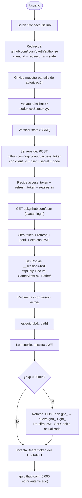

# 🔐 MeperBoard — Plan de Autenticación v2.1

> **v2**: Incorpora la refutación técnica sobre Device Flow, almacenamiento de
> tokens e infraestructura de sesión. Las correcciones están fundamentadas en
> evidencia verificada por investigación independiente.
>
> **v2.1**: Cierra tres huecos de integración detectados en revisión: ciclo de
> vida del token (expiración de 8hs + refresh), CSP compatible con Next.js
> (nonce por request, obligatorio por los scripts inline del App Router) y
> eliminación del snapshot `installed_repos` del payload de la cookie.

---

## 0. Correcciones sobre el Plan v1

| Punto del Plan v1 | Error | Corrección |
| :--- | :--- | :--- |
| Device Flow como opción "cero backend" | `github.com/login/device/code` y `/login/oauth/access_token` **no soportan CORS**. Cualquier variante requiere un hop de servidor, eliminando la ventaja alegada. | Eliminado. Se usa **Web Application Flow** exclusivamente. |
| Device Flow como UX válida para web | Device Flow existe para clientes **sin navegador** (CLIs, smart TVs, IoT). Una web app tiene navegador — el redirect es más simple y mejor UX. | Web Flow es conceptualmente correcto para este caso. |
| Token en IndexedDB | IndexedDB es accesible por **cualquier JS** en la página. Si MeperBoard renderiza Markdown de terceros, un XSS en el renderer puede exfiltrar el token. | Token en **cookie httpOnly+Secure+SameSite cifrada con JWE**. JS no puede leerla. |
| OAuth App con scope `repo` | `repo` otorga **lectura y escritura** a TODOS los repos del usuario. Blast radius máximo. | **GitHub App** con permisos granulares read-only (Issues, PRs, Metadata). |
| Store de sesiones (KV/Redis/DB) | Infraestructura innecesaria para una app stateless. | Cookie JWE **stateless** — sin store de sesión en servidor. |
| Relay abierto (`/api/github/[...path]`) | Sin origin check, sin allowlist. Sirve un `GITHUB_TOKEN` compartido a cualquier caller. | Se cierra **ANTES** de cualquier auth: origin check + per-user token. |

---

## 0.1 Correcciones v2 → v2.1

| Hueco | Severidad | Problema | Fix |
| :--- | :--- | :--- | :--- |
| Token expira a las 8h, cookie vive 30d | 🔴 Bloqueante | Los `ghu_` de GitHub App expiran en 8 horas (default recomendado). Sin refresh, `401` masivo a la hora 8. | Guardar `refresh_token` (`ghr_`, 6 meses) en el JWE + ruta de refresh transparente server-side con rotación. |
| CSP rompe Next.js | 🔴 Bloqueante | `script-src 'self'` sin nonce tumba el App Router: Next.js inyecta `<script>` inline con el payload RSC (`self.__next_f.push`). | Middleware que genera nonce por request + `'strict-dynamic'`. Se suman `object-src 'none'`, `base-uri 'self'`, `frame-ancestors 'none'`. |
| `installed_repos` en el JWE | 🟡 Medio | Snapshot congelado hasta 30 días (repos nuevos/desinstalados = switcher miente). Usuarios con muchos repos revientan el ~4KB de cookie. | Repos se listan **en vivo** vía proxy (`GET /user/repos`). Nunca en la cookie. |
| Sin `exp` en el JWE | 🟡 Nit | Sin defensa en profundidad más allá de Max-Age del navegador. | Claim `exp` dentro del payload JWE. |
| Logout solo borra cookie | 🟡 Nit | Token `ghu_` sigue válido 8h tras "desconectar". | Logout opcionalmente revoca el `ghu_` server-side vía API de GitHub Apps antes de borrar la cookie. |

---

## 1. Arquitectura Final



### Por qué GitHub App y no OAuth App

| | OAuth App | GitHub App |
| :--- | :--- | :--- |
| **Permisos** | Scopes amplios (`repo` = full read+write) | Granulares por recurso (`Issues: read`, `PRs: read`, `Metadata: read`) |
| **Blast radius** | Compromiso = acceso total a todos los repos | Solo repos donde está instalada, solo permisos otorgados |
| **Rate limit** | 5,000/hr por usuario | 5,000/hr por usuario + tokens de instalación |
| **Para MeperBoard** | Pediría `repo` (overkill para read-only) | Pide exactamente lo que necesita |

---

## 2. Componentes y Rutas de API

### Rutas Nuevas

| Ruta | Método | Responsabilidad |
| :--- | :--- | :--- |
| `/api/auth/login` | `GET` | Genera `state` (CSRF), redirige a GitHub con `client_id`, `redirect_uri`, `state` |
| `/api/auth/callback` | `GET` | Recibe `code` + `state`, valida CSRF, intercambia code → token (server-side), cifra con JWE, setea cookie, redirige a `/` |
| `/api/auth/logout` | `POST` | Revoca el `ghu_` server-side vía API de GitHub Apps (best-effort), luego borra la cookie de sesión. |
| `/api/auth/me` | `GET` | Lee cookie JWE, devuelve perfil público (login, avatar) sin exponer el token. Repos se listan en vivo vía proxy. |

### Ruta Existente Modificada

| Ruta | Cambio |
| :--- | :--- |
| `/api/github/[...path]` | Ya no usa `GITHUB_TOKEN` del env. Lee el token **del usuario** desde la cookie JWE. Si no hay cookie → `401`. Si `exp` < 30min → refresh transparente antes de llamar upstream. Si GitHub responde `401` → un único intento de refresh y reintento. Se agrega validación de `Origin`/`Referer`. |

### Componentes UI

| Componente | Ubicación | Descripción |
| :--- | :--- | :--- |
| `AuthButton` | `AppHeader` | Estado desconectado: "Connect GitHub". Estado conectado: avatar + login del usuario. |
| `AuthMenu` | Dropdown del `AuthButton` | Perfil, repo activo, rate limit, logout. |
| `ConnectModal` | Overlay | Explica qué permisos se solicitan. Botón primario: "Authorize with GitHub". Fallback: enlace a docs de PAT para self-host. |
| `RepoSwitcher` | `AppHeader` o `ConnectModal` | Combobox con fuzzy search de repos del usuario (post-auth). Lista **en vivo** vía proxy (`GET /user/repos`), nunca desde un snapshot en la cookie. |

---

## 3. Seguridad

### Cookie JWE (Stateless)

```
Set-Cookie: __session=eyJhbGc...encrypted...
  HttpOnly;          ← JS no puede leer
  Secure;            ← Solo HTTPS
  SameSite=Lax;      ← CSRF protection nativa
  Path=/;            ← Disponible en todas las rutas de API
  Max-Age=2592000;   ← 30 días (tope absoluto de sesión)
```

**Contenido cifrado (JWE payload):**
```json
{
  "token": "ghu_xxxxxxxxxxxxxxxxxxxx",
  "refresh_token": "ghr_xxxxxxxxxxxxxxxxxx",
  "login": "meperdonas",
  "avatar_url": "https://avatars.githubusercontent.com/u/...",
  "iat": 1724300000,
  "exp": 1724328800
}
```

> **Por qué cada campo está acá:**
> - `refresh_token`: los `ghu_` **expiran a las 8 horas** ("Expire user
>   authorization tokens" activado, default recomendado en apps nuevas). Sin
>   esto, toda sesión muere a la hora 8 con `401`. El `ghr_` vive 6 meses.
> - `exp`: vencimiento del access token en epoch seconds. Permite refresh
>   proactivo sin llamar a GitHub para consultarlo.
> - `iat`: timestamp de emisión para auditoría y tope absoluto de sesión.
> - NO va `installed_repos`: sería un snapshot congelado hasta 30 días y un
>   usuario con muchos repos revienta el límite de ~4KB de cookie. Los repos
>   se listan **en vivo** vía proxy (`GET api.github.com/user/repos`).

> **¿Por qué no se puede robar?**
> `httpOnly` impide que `document.cookie` o cualquier JS acceda al valor.
> Aunque un XSS logre ejecutar `fetch("/api/github/repos/...")` *actuando*
> como el usuario dentro de la app, **no puede extraer el token crudo**
> para reutilizarlo fuera del navegador. El daño queda acotado al scope
> read-only de la GitHub App.

### Ciclo de Vida del Token (Crítico)

Los user access tokens de GitHub App **expiran a las 8 horas**; la cookie
vive 30 días. Sin manejo de refresh, todos los usuarios comerían `401`
a la hora 8. La sesión se mantiene así:

1. **Proactivo**: al leer la cookie, si `exp` falta menos de 30 minutos o ya
   pasó → refresh antes de llamar a GitHub.
2. **Reactivo**: si GitHub responde `401` de todos modos → un único intento
   de refresh y reintento.
3. Refresh = `POST github.com/login/oauth/access_token` con `client_id`,
   `client_secret`, `grant_type=refresh_token` y el `ghr_`. GitHub devuelve
   nuevo `ghu_` + nuevo `ghr_` (rotación).
4. Se re-cifra el JWE completo y se devuelve `Set-Cookie` actualizado en la
   misma respuesta. Transparente para el usuario.
5. Si el refresh falla (token revocado o `ghr_` expirado): se borra la
   cookie y se responde `401` → el usuario reconecta.
6. El Max-Age de 30 días queda como **tope absoluto de sesión** (política
   deliberada): pasado ese mes, re-login aunque el refresh siga válido.
7. Decisión explícita: NO se desactiva la expiración de tokens.

### Cierre del Relay Abierto (Pre-requisito)

**ANTES** de implementar auth, el proxy actual se endurece:

1. **Origin check**: Solo acepta requests cuyo `Origin` o `Referer` coincida con el dominio de la app.
2. **Cookie required**: Sin cookie `__session` válida → `401 Unauthorized`.
3. **Path allowlist** (opcional pero recomendado): Solo rutas que el sync necesita (`repos/{owner}/{repo}/issues`, `repos/{owner}/{repo}/pulls`).
4. **Se elimina `GITHUB_TOKEN` del env** en producción — cada request usa el token del usuario autenticado.

### CSP con Nonce (Obligatoria para Next.js)

⚠️ `script-src 'self'` a secas **rompe la aplicación**: el App Router de
Next.js inyecta `<script>` inline con el payload RSC (`self.__next_f.push`).
El patrón canónico (guía oficial de Next.js) es middleware que genera un
nonce por request:

```
Content-Security-Policy:
  default-src 'self';
  script-src 'self' 'nonce-{N}' 'strict-dynamic'{ dev: 'unsafe-eval' };
  style-src 'self' 'unsafe-inline';
  img-src 'self' https://*.githubusercontent.com data:;
  connect-src 'self';
  object-src 'none';
  base-uri 'self';
  frame-ancestors 'none';
```

- `'nonce-{N}' + 'strict-dynamic'`: permite los scripts inline de Next.js y
  bloquea todo lo demás. El nonce viaja por header `x-nonce` al SSR.
- `style-src 'unsafe-inline'` se conserva a propósito: framer-motion/React
  escriben estilos vía CSSOM desde JS (no los bloquea CSP) y algunos estilos
  inline en markup no se cubren con nonce.
- `object-src 'none'`: previene inyección de Flash/plugins legacy.
- `base-uri 'self'`: previene manipulación de la base URL del documento.
- `frame-ancestors 'none'`: previene clickjacking (equivale a X-Frame-Options DENY).
- Consecuencia aceptada: el nonce fuerza **render dinámico** en todas las
  páginas. Para un dashboard client-heavy como MeperBoard, costo nulo.

Markdown renderizado desde issues/PRs se sanitiza con una allowlist de tags
HTML seguros (no `<script>`, no `<iframe>`, no event handlers).

---

## 4. Fallback: Quick PAT para Self-Host

Para usuarios que deployean su propia instancia y no quieren registrar una GitHub App:

1. Documentado en `docs/SELF_HOST.md`.
2. Variable de entorno `GITHUB_TOKEN` vuelve a funcionar **solo** cuando `AUTH_MODE=pat` en `.env`.
3. El proxy valida `Origin` igualmente.
4. No se expone como opción en la UI pública.

---

## 5. Fases de Implementación

| Fase | Scope | Entregables |
| :--- | :--- | :--- |
| **Fase 0** | **Cierre del relay + CSP** | Origin check en el proxy, middleware CSP con nonce + `strict-dynamic`, sanitizado de markdown. Esto se hace PRIMERO, sin depender de auth. |
| **Fase 1** | **Infraestructura de Auth** | Registro de GitHub App en GitHub, rutas `/api/auth/*`, cifrado JWE (con `refresh_token` y `exp`), cookie, refresh con rotación, hook `useAuth()` client-side. |
| **Fase 2** | **Proxy per-user** | El proxy lee token de la cookie JWE en lugar de `GITHUB_TOKEN`. Refresh proactivo + reactivo. Endpoint `/api/auth/me` para perfil. |
| **Fase 3** | **UI de Auth** | `AuthButton`, `ConnectModal`, `AuthMenu` con avatar, login y rate limit. |
| **Fase 4** | **Repo Switcher** | Selector dinámico de repositorios del usuario (en vivo), reemplaza `DEFAULT_REPO` hardcodeado. |

---

## 6. Dependencias de Paquetes

| Paquete | Motivo | Tamaño |
| :--- | :--- | :--- |
| `jose` | JWE encrypt/decrypt (estándar, zero-dep, Edge-compatible) | ~45KB |
| `dompurify` (o `rehype-sanitize`) | Sanitizado de HTML en markdown renderizado | ~25KB |

No se necesita: NextAuth, iron-session, Redis, ni ningún store de sesiones.

---

## 7. Sugerencia Frontend: Command Palette (⌘K)

### Motivación

La app ya tiene palette picker, theme toggle, nav items y pronto tendrá auth
button, repo switcher y más acciones. En lugar de multiplicar dropdowns y
botones en el header, se propone unificar todo bajo un **Command Palette**
activado con `⌘K` / `Ctrl+K` — el patrón estándar de las herramientas
open-source modernas (Linear, Raycast, Vercel Dashboard, GitHub mismo).

### Qué resuelve

- **Discoverability**: el usuario tiene un único punto de entrada para TODO.
  Busca "dark" → cambia el tema. Busca "cyber" → cambia la paleta. Busca un
  repo → lo selecciona. Busca "connect" → abre auth. Busca un issue por título
  → abre el preview drawer.
- **Keyboard-first**: para devs que viven en el teclado (el público objetivo
  de una herramienta estilo Lazygit/gh CLI en la web).
- **Escalabilidad de UI**: cada feature nueva que agreguemos es un comando
  registrado, no un botón más en el header.

### Grupos de Comandos

| Grupo | Ejemplos |
| :--- | :--- |
| **Navigation** | `Go to Board`, `Go to Backlog`, `Go to Issue #42` |
| **Theme** | `Switch to Dark`, `Switch to Light`, `Palette: Cyber Lime`, `Palette: Terracotta` |
| **Auth** | `Connect GitHub`, `Switch Repository`, `Disconnect` |
| **Cards** | `Search cards...` (fuzzy por título), `Create local card` |
| **Quick Actions** | `Sync now`, `Toggle local cards panel` |

### Integración Visual

- El trigger en el header es un `SearchInput`-style pill: `⌘K` con un ícono
  de búsqueda, inline entre la nav y los toggles actuales. Clickeable o por
  shortcut.
- El overlay usa el **mismo lenguaje de diseño** que el palette picker y el
  preview drawer: `bg-popover/95 backdrop-blur-md`, bordes con
  `border-border/50`, animación `framer-motion` spring.
- Los resultados muestran el swatch de color al lado de cada paleta, el avatar
  del usuario al lado de los comandos de auth, y el icono de issue/PR al lado
  de las cards.
- El accent color del tema activo tiñe la selección activa del listado, igual
  que ya hace el palette picker con el `bg-accent`.

### Fase propuesta

Se implementa en **Fase 3** junto con la UI de Auth, ya que el Command Palette
absorbe naturalmente los comandos `Connect GitHub`, `Switch Repository` y
`Disconnect` que de otro modo necesitarían su propio dropdown. También absorbe
los items que hoy ya viven como botones sueltos (theme toggle, palette picker).
